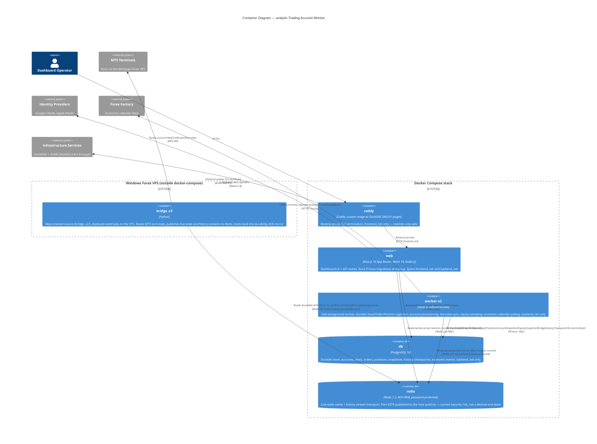

# C4 Model — analytic (Trading Account Monitor)

Scope: whole repository. Levels: Context and Container (Simon Brown's default; no
Component/Code level produced). Source: retro-documented from `docker-compose.yml`,
`src/worker-v2/`, `src/app/api/`, `bridge_v2/`, `Caddyfile`, `prisma/schema.prisma`
on 2026-07-30.

## Context Diagram

## Container Diagram

## Durability Protocol (detail, not a separate C4 level)

1. `bridge_v2` (`history_publisher.py`) writes deal/order records to Redis Streams
   (`mt5:v2:history:deals`, `mt5:v2:history:orders`) in bounded chunks, each followed
   by a barrier message.
2. `worker-v2` consumes the streams via `XREADGROUP` consumer groups, reconstructs
   the chunk, and commits it to PostgreSQL inside a transaction
   (`BridgeHistoryCheckpoint` / `BridgeHistoryChunk` / `BridgeHistoryRecord`).
3. Only after the PostgreSQL commit succeeds, `worker-v2` writes an ACK mirror key
   (`mt5:v2:history:{accountNo}:ack`) to Redis.
4. `bridge_v2` reads that ACK key before advancing its own history cursor — Redis
   is the transport and coordination mirror; PostgreSQL is the durable source of
   truth. This is a bidirectional handshake, not a one-way pipe.

## Groupings Applied

- **Identity providers**: Google OAuth, Apple OAuth — grouped as one external system
  (`identity`), both consumed only by NextAuth v5 in `web`.
- **Infrastructure services**: DuckDNS (dynamic DNS) and the ACME certificate
  issuers (ZeroSSL primary, Let's Encrypt fallback) — grouped as one external
  system (`infra`), both consumed only by `caddy` for TLS.

## Assumptions

- `bridge_v2` is treated as in-repo source (`bridge_v2/` is version-controlled)
  deployed externally on the Windows Forex VPS, not part of the docker-compose
  topology. Not independently verified that the VPS runs the exact same commit
  as the repo's `HEAD` at any given time — assumed based on the `ssh-vps` skill's
  deploy-via-`git pull` workflow.
- The Redis port 6379 public exposure is documented here as the mechanism that
  lets the externally-deployed `bridge_v2` reach the compose-internal Redis
  container. It is flagged as a current security risk per user correction, not
  modeled as an intended architectural boundary.
- `web`'s call to Forex Factory is explicitly shown as not happening (only
  `worker-v2` polls it) to avoid implying a duplicate/ambiguous edge.

## Omitted / Out of Scope

- **`src/worker-v3`** — confirmed dead scaffolding (no docker-compose service, no
  imports from `web` or `worker-v2`). Omitted entirely from both diagrams.
- **Component and Code levels** — not produced; not requested.

## Operations Notes (not part of the C4 diagrams)

- `worker-v2` exposes a component-health endpoint on port 9200, restricted to
  `backend_net`. It is not reachable from `caddy` or `web`, and no code in this
  repo calls it — it exists for manual/ops inspection (e.g. `docker exec` +
  `curl`, or an external monitor attached directly to `backend_net`), not as an
  application-level integration. Deliberately excluded from the Container
  diagram to avoid implying an in-application dependency.
