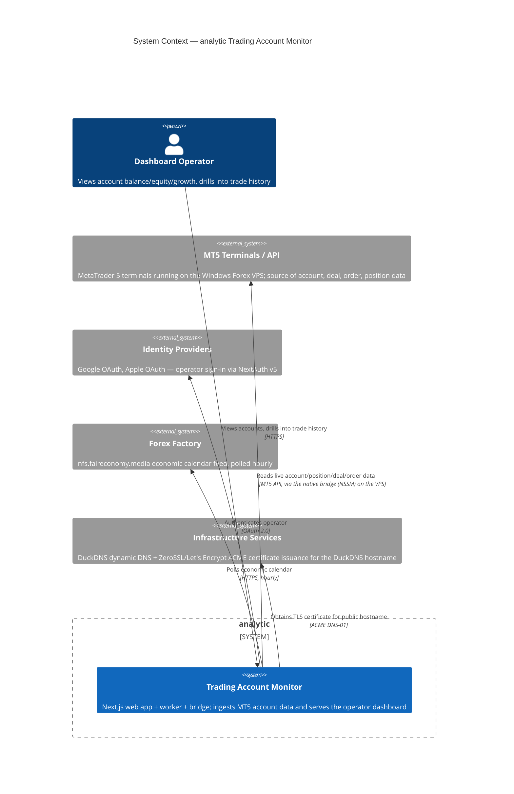
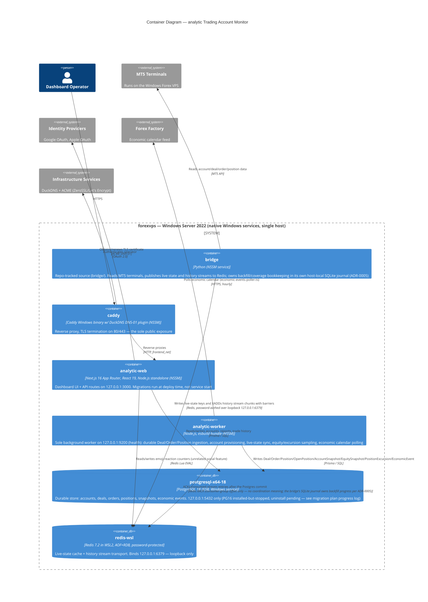

# C4 Model — analytic (Trading Account Monitor)

Scope: whole repository. Levels: Context and Container (Simon Brown's default; no
Component/Code level produced). Originally retro-documented 2026-07-30; maintained
against `src/worker-v2/`, `src/app/api/`, `bridge/`, `Caddyfile.windows`,
`prisma/schema.prisma`. Last audited 2026-08-26 — the retired `docker-compose.yml`
topology and `src/worker`/`src/worker-v3` runtimes are gone from the repo.

## Context Diagram

## Container Diagram

## Durability Protocol (detail, not a separate C4 level)

> **Superseded mechanism (kept as record):** this barrier/checkpoint handshake is the LEGACY bridge_v2 pipeline. The native bridge (`bridge/`) now publishes to `mt5:account:{login}:stream:history` and owns backfill/coverage state in its own per-account SQLite journal — `BridgeHistoryCheckpoint/Chunk/Record` are retired, unused by the live consumer (see `docs/architecture-data-models.md`).

1. `bridge` (`history_publisher.py`) writes deal/order records to Redis Streams
   (`mt5:v2:history:deals`, `mt5:v2:history:orders`) in bounded chunks, each followed
   by a barrier message.
2. `worker-v2` consumes the streams via `XREADGROUP` consumer groups, reconstructs
   the chunk, and commits it to PostgreSQL inside a transaction
   (`BridgeHistoryCheckpoint` / `BridgeHistoryChunk` / `BridgeHistoryRecord`).
3. Only after the PostgreSQL commit succeeds, `worker-v2` writes an ACK mirror key
   (`mt5:v2:history:{accountNo}:ack`) to Redis.
4. `bridge` reads that ACK key before advancing its own history cursor — Redis
   is the transport and coordination mirror; PostgreSQL is the durable source of
   truth. This is a bidirectional handshake, not a one-way pipe.

## Groupings Applied

- **Identity providers**: Google OAuth, Apple OAuth — grouped as one external system
  (`identity`), both consumed only by NextAuth v5 in `web`.
- **Infrastructure services**: DuckDNS (dynamic DNS) and the ACME certificate
  issuers (ZeroSSL primary, Let's Encrypt fallback) — grouped as one external
  system (`infra`), both consumed only by `caddy` for TLS.

## Assumptions

- The bridge (`bridge/`, NSSM service) runs on the same forexvps host as the
  analytic stack — the former two-host split (bridge on the Windows VPS, app
  stack in Docker Compose on a Linux host) was retired in the 2026-08 single-host
  migration. Deploy = `git pull` on the host + on-host rebuild.
- The former public Redis 6379 exposure (which let the externally-deployed bridge
  reach the compose-internal Redis on the retired Linux host) is ELIMINATED by the
  single-host topology — Redis now binds loopback only.
- `web`'s call to Forex Factory is explicitly shown as not happening (only
  `worker-v2` polls it) to avoid implying a duplicate/ambiguous edge.

## Omitted / Out of Scope

- **`src/worker-v3`** — dead scaffolding, since deleted from the repo entirely
  (never ran in production). Omitted from both diagrams.
- **Component and Code levels** — not produced; not requested.

## Operations Notes (not part of the C4 diagrams)

- `worker-v2` exposes a component-health endpoint on port 9200. The code binds
  `0.0.0.0` (`src/worker-v2/health.ts`), NOT loopback as an earlier version of
  this note claimed — the Windows firewall (inbound only 80/443) is what keeps
  it host-private. No code in this repo calls it — it exists for on-host ops
  inspection via the vps-ops runbook (e.g. `Invoke-WebRequest
  http://127.0.0.1:9200/health`), not as an application-level integration.
  Deliberately excluded from the Container diagram to avoid implying an
  in-application dependency.
