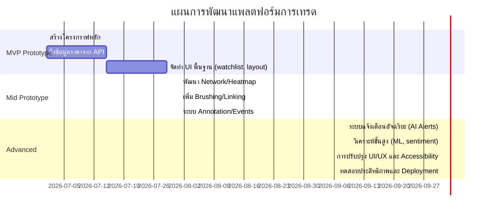

# การออกแบบการนำเสนอข้อมูลเชิงลึกสำหรับแพลตฟอร์มการเทรด 

**สรุปผู้บริหาร:** ผลสำรวจพบว่าการยกระดับกราฟในระบบการเทรดจากตัวเลขผิวเผินไปสู่องค์ความรู้เชิงระบบ (systemic insight) จำเป็นต้องออกแบบภาพข้อมูลที่เน้น *ความลึก* (depth) ของข้อมูล – เช่น แสดงความสัมพันธ์ระหว่างสินทรัพย์ (inter-relationships) ภายในการเทรด . กราฟใหม่ ๆ เช่น เครือข่ายสัมพันธ์ (network graphs) แผนภาพแบบหลายชั้น (layered/horizon/streamgraphs) และการจำลองการไหลของเงินทุน (flow/Sankey) สามารถช่วยเผยให้เห็นโครงสร้างภายในตลาดได้ดียิ่งขึ้น โดยผสานหลักการรับรู้ด้านภาพ เช่น ลำดับชั้นข้อมูล (visual hierarchy), โฟกัส-บริบท (focus+context), การจัดกลุ่มเล็ก (small multiples), สัญลักษณ์ข้อมูล (glyphs), และการอินเทอร์แอคทีฟหลายระดับ (multiscale interaction) เพื่อไม่ให้เกิดความล้นข้อมูล. ระบบต้องรองรับข้อมูลเรียลไทม์ระดับสูง (tick data, orderbook, indicator, ข่าวข่าวสาร) พร้อมเทคนิคประมวลผลล่วงหน้า (เช่น การจัดรูปข้อมูล, การคำนวณความสัมพันธ์/เหตุผลเชิงสาเหตุ, การจัดแนวของเหตุการณ์) เพื่อให้การแสดงผลเชื่อมโยงกับสถานการณ์ตลาดจริง การออกแบบต้องคำนึงประสิทธิภาพและความหน่วงของระบบ (latency), การเข้าถึงของผู้ใช้ทุกกลุ่ม (accessibility) โดยเฉพาะความต่างของสี (color-blindness), รวมทั้งวิธีประเมินผลเชิงคุณภาพและเชิงปริมาณ (interviews, eye-tracking, A/B test ฯลฯ) เพื่อพิสูจน์ว่าเครื่องมือใหม่ทำให้ผู้เทรดมองเห็น “ความลึก” ของข้อมูลได้ดีกว่าเดิม. รายงานนี้สรุปหลักการออกแบบสำคัญ, ตัวอย่างชนิดกราฟใหม่กับงานเทรด, ตารางเปรียบเทียบกราฟ-งาน, แนวทางการวางแผนพัฒนา (roadmap) และแผนทดสอบ เพื่อให้ทีมพัฒนาแพลตฟอร์มการเทรดมีแนวทางทำงานอย่างเป็นระบบและเป็นขั้นตอน (MVP → Mid → Advanced) ได้อย่างชัดเจน. 

## เป้าหมายและบุคลิกภาพผู้ใช้ (Goals & Personas)  
ตลาดการเทรดมีผู้ใช้งานหลากหลาย ตั้งแต่เทรดเดอร์รายย่อย (retail traders) ไปจนถึงเทรดเดอร์สถาบันหรือบริษัท (prop traders, quant traders) แต่ส่วนใหญ่มีเป้าหมายคล้ายกันคือ **ตัดสินใจเทรดได้อย่างมั่นใจและรวดเร็ว** ในช่วงเวลาตลาดผันผวน. เทรดเดอร์รายย่อยต้องการอินเทอร์เฟซที่เรียบง่าย เข้าใจง่าย พอดีข้อมูล (progressive disclosure) เพราะความซับซ้อนของกราฟหรือข้อมูลมากเกินไปทำให้สับสน ยอมแพ้ได้ง่าย. ขณะเดียวกัน เทรดเดอร์มืออาชีพหรือสถาบันคาดหวังข้อมูลเข้มข้นสูง (high data density) บนจอเดียว เช่น ดูราคา, ปริมาณซื้อขาย, พอร์ตกองทุนแบบละเอียด, สัญญาณหลายตัวพร้อมกันได้ ซึ่งกลุ่มนี้ทนรับหน้าจอที่มีข้อมูลหนาแน่นได้มากกว่า. ผู้ใช้อีกรายหนึ่งคือ **นักวิเคราะห์เชิงปริมาณ (quant)** หรือ **data scientists** ภายในวงการการเงิน ที่ต้องการดึงข้อมูลออกมาวิเคราะห์ต่อ (เช่น การคำนวณสถิติ, backtesting models) จึงเน้นที่ API และการดาวน์โหลดข้อมูลมากกว่าอินเทอร์เฟซกราฟ. ทั้งนี้ ผู้พัฒนาต้องวางเป้าหมายเพื่ออำนวยความสะดวกให้ทุกกลุ่มสมดุลกัน เช่น การจัดวางเลย์เอาต์ชัดเจน (Visual Hierarchy) ที่แสดงราคาสินทรัพย์เรียลไทม์ไว้ด้านบนตัวอักษรใหญ่ชัดเจน แล้วลดระดับลงไปสู่ค่ารองอื่น ๆเพื่อให้เข้าใจง่าย, ระบุสีเขียว/แดงมาตรฐานเพื่อสื่อขึ้น-ลง, หรือปุ่มเทรดที่เด่นชัดเพื่อดึงความสนใจ. งานวิจัยพบว่าแม้เทรดเดอร์มืออาชีพจะมีทักษะด้านการเลือกดูภาพข้อมูลดีขึ้น (เช่น แยกแยะเลขได้แม่นกว่าในชุดเล็กๆ) แต่เมื่อข้อมูลมากขึ้น หรือหน้าจอล้นไปด้วยองค์ประกอบที่ไม่เกี่ยวข้อง จะส่งผลให้การตัดสินใจช้าลง เหมือนคนทั่วไป. เช่นกัน การสำรวจผู้ใช้ TradingView พบว่า **84% ของผู้ใช้** บ่นว่าจัดการหลายกราฟพร้อมกันไม่สะดวก และ **49%** บอกว่ายากที่จะจับแนวโน้มตลาดจากกราฟซับซ้อน – แสดงว่าต้องมีการจับคู่กราฟเข้ากับงานให้เหมาะสม (ดูตารางด้านล่าง) และเพิ่มเครื่องมืออำนวยความสะดวก เช่น การเชื่อมโยงหลายหน้าต่าง (brushing & linking) เพื่อช่วยให้ “ภาพรวม” ยังอยู่ และข้อมูลรายละเอียดปรากฏเมื่อเข้ามาโฟกัสจุดใดจุดหนึ่ง (focus+context). 

## หลักการรับรู้และการออกแบบภาพ (Cognitive/Visual Principles)  
การออกแบบต้องใช้หลักการทางการรับรู้ที่ช่วยลดภาระรู้คิด (cognitive load) และให้ความสำคัญกับข้อมูลสำคัญเป็นอันดับแรก หลักการสำคัญได้แก่:  

- **ลำดับชั้นข้อมูล (Visual Hierarchy):** จัดวางองค์ประกอบกราฟอย่างชัดเจน เช่น ให้ข้อมูลราคาสินทรัพย์เป็นข้อมูลสำคัญที่สุด เน้นตัวเลขใหญ่ สีตัดกันสูง, ส่วนข้อมูลรองอื่นๆ (เช่น ปริมาณซื้อขาย, ราคาเปิด-ปิดประจำวัน) อยู่ลำดับถัดไป ด้วยตัวอักษรเล็กลงหรือสีอ่อนลง. หลักการนี้ช่วยให้ผู้ใช้โฟกัสข้อมูลหลักได้ง่ายและเร็วขึ้น ทดแทนกับบริเวณข้อมูลที่ไม่จำเป็นต้องเห็นทันที.  
- **เลเยอร์/การซ้อนทับ (Layering):** ใช้เทคนิคเลเยอร์ในกราฟเดียว เช่น *Horizon Chart* หรือชาร์ตพื้นทึบแบบแบ่งช่วง เพื่อให้ดึงเส้นกราฟหรือการเปลี่ยนแปลงของข้อมูลเป็นชั้นซ้อนกัน ทำให้ข้อมูลแนวโน้มเด่นชัดและประหยัดพื้นที่ (compact). เมื่อประกบกราฟหลายชุดในพื้นที่เล็ก (small multiples) จะช่วยเปรียบเทียบหลายสินทรัพย์ได้ง่ายขึ้น.  
- **โฟกัส-บริบท (Focus+Context):** อนุญาตให้ซูมเข้า-ออก แสดงรายละเอียดเฉพาะส่วนที่สนใจโดยยังคงเห็นภาพรวมอยู่เสมอ (เช่น having overview + detail-on-demand). ตัวอย่างเช่น ใช้กรอบมุมมองแบบเลนส์ (fisheye หรือ semantic zoom) หรือใช้ small multiples ให้เทียบเปรียบเทรนด์สินทรัพย์ต่างๆ พร้อมกัน.  
- **การสร้างภาพขนาดเล็กหลายชุด (Small Multiples):** แทนที่จะอัดข้อมูลทับซ้อนในกราฟเดียว ให้แยกกราฟออกเป็นกราฟเล็กๆ หลายอัน (แต่มีมาตรวัดเกณฑ์เดียวกัน) เพื่อให้อ่านเปรียบเทียบเทรนด์ได้ง่าย เช่น แผงกราฟหลายสินทรัพย์วางเคียงกัน. ช่วยลดความแออัดของข้อมูล (visual clutter) และลด bias จากความซับซ้อน.  
- **สัญลักษณ์ข้อมูล (Glyphs):** ใช้รูปทรง/ไอคอนแสดงค่าพหุมิติ (เช่น star glyph, Chernoff face, หรือ shape matrix) ที่ฝังค่าตัวเลขหลายตัวในสัญลักษณ์เดียว ทำให้เห็นภาพรวมหลายมิติเกี่ยวกับหลักทรัพย์นั้นได้ง่ายขึ้น (เช่น ปริมาณ, แรงขึ้น-ลง, โมเมนตัม).  
- **โต้ตอบหลายระดับ (Multiscale Interaction):** ผู้ใช้สามารถสลับดูข้อมูลได้หลายช่วงเวลา (Multi-resolution) หรือหลายมุมมองพร้อมกัน เช่น ย่อ-ขยายแกนเวลา, เปลี่ยนช่วงเวลาของกราฟ, คลิกเลือกกลุ่มหุ้นแล้วแสดงรายละเอียดเฉพาะ.  
- **สีและสัญลักษณ์ (Color & Visual Encoding):** ยึดมาตรฐานสีเขียว=กำไรแดง=ขาดทุน เพื่อให้ตรงกับความคาดหวังผู้ใช้ (ผู้ใช้คุ้นเคยกับสีนี้มาก). อย่างไรก็ตาม ต้องคิดเรื่องผู้บกพร่องสี (Color-blind) ด้วย: ต้องมีสัญญะอื่นประกอบ เช่น ลูกศร, รูปไอคอน, หรือลายเส้นต่างความหนาชัดเจน เพราะสีเพียงอย่างเดียวไม่พอ. เช่น การใช้สีเขียวแดงแค่นั้นไม่พอสำหรับคนตาบอดสี ควรมีรูปแสดงลูกศรขึ้น-ลงหรือเครื่องหมาย +/– ประกอบอีกที.  

การใช้หลักการเหล่านี้ช่วยสร้างอินเทอร์เฟซที่ไม่ล้นข้อมูล (minimize clutter) และเพิ่มความเข้าใจ ยกตัวอย่างงานวิจัยพบว่า การจัดเลย์เอาต์ที่มีข้อมูลมากเกินไป (cluttered display) ทำให้ภาระรู้คิดเพิ่ม การตัดสินใจช้าลง และเกิดการเบี่ยงเบนจากความเป็นจริงได้. ดังนั้น เราต้องออกแบบให้ลดความซับซ้อนในแถบอินเทอร์เฟซหลัก ลดเสียงรบกวน (irrelevant info) และเปิดโอกาสให้ผู้ใช้โฟกัสกับข้อมูลที่เกี่ยวข้องที่สุดในการตัดสินใจ (selective attention).  

## ประเภทกราฟใหม่และกราฟปรับปรุง (Novel & Adapted Chart Types)  
เพื่อเผย “ความสัมพันธ์และโครงสร้างภายในตลาด” ได้ชัดเจนขึ้น ต้องนำเสนอกราฟหลายแนวทางร่วมกัน แต่ผสานตามวัตถุประสงค์ เช่น:  

- **กราฟเครือข่ายความสัมพันธ์ (Relational Network Maps):** แสดงความเชื่อมโยงระหว่างสินทรัพย์/กลุ่ม เช่น โหนดแทนหุ้น หรือภาคธุรกิจ และเส้นเชื่อมแสดงความสัมพันธ์ (เช่น ความสัมพันธ์การเคลื่อนไหวของราคา) หรือการไหลของเงินทุนภายในภูมิภาคใดภูมิภาคหนึ่ง. เช่น เครือข่ายโหนด-เชื่อมโยงแบบ Graph สามารถแสดงกลุ่มสินทรัพย์ที่เคลื่อนไหวไปในทิศทางเดียวกัน (Clusters) หรือช่องทางการส่งผ่านของสัญญาณทางการเงินได้. ข้อดีคือช่วยให้เห็นภาพความสัมพันธ์เชิงกลุ่มและโครงข่ายได้ง่ายขึ้น. ตัวอย่าง: หากต้นทุนขยายตัวในกลุ่มเทคโนโลยี โหนดกลุ่มเทคโนโลยีในเครือข่ายอาจขยับใหญ่ขึ้น, หรือมีเส้นหนาขึ้นระหว่างหุ้นเทคโนโลยีด้วยกันเอง.   
- **แผนที่ความลึกแบบมัลติแวเรียนท์ (Multivariate Depth Heatmaps):** ใช้แผนที่ความร้อน (heatmap) ข้อมูลหลายมิติ เช่น แกน X อาจเป็นเวลา แกน Y เป็นหุ้นต่าง ๆ ในพอร์ต, และสีแสดงค่าดัชนี (เช่น ความเปลี่ยนแปลงราคา, ปริมาณซื้อขาย, หรือ correlation กับตัวชี้วัดอื่น). หรืออาจทำเป็นแบบ 2D matrix ที่แกน X,Y ต่างเป็นรายการสินทรัพย์ แล้วช่องสีแสดงระดับ correlation/volatility. แผนที่เหล่านี้ช่วยให้เห็นระดับความแข็งแรงของตัวชี้วัดต่างๆ ข้ามสินทรัพย์เป็นกลุ่มได้รวดเร็ว.  
- **Horizon Chart / Streamgraph (พื้นที่แบบไหล):** เป็นการปรับพื้นที่กราฟ area ให้ชั้นข้อมูลซ้อนทับกันในแกนตั้งเล็ก ๆ ซึ่งลดพื้นที่ใช้ในการแสดงแต่ยังรักษาแนวโน้มไว้. กราฟแนว *Horizon Chart* สามารถรวมข้อมูล time-series ที่มีช่วงสูงต่ำแบบสองชั้น (สองโทนสี) ให้ดูทรงพลังขึ้นได้ในพื้นที่แคบ ๆ. ส่วน *Streamgraph* (stacked area รอบแกนกลาง) ช่วยแสดงส่วนแบ่งหรือปริมาณแบบเปลี่ยนตามเวลา (เช่น ปริมาณตลาดตามประเภทสินทรัพย์) อย่างพริ้วไหว. การโต้ตอบเช่นการปรับ layer, เปลี่ยน scale สี, ซูมช่วงเวลาก็ทำให้กราฟเหล่านี้มีประสิทธิภาพสูง [31†埋め込む].  
 *ภาพ: ตัวอย่าง Horizon Chart ที่ซ้อนสองโทนสี แสดงการเปลี่ยนแปลงข้อมูลหลายชุดโดยใช้พื้นที่แนวตั้งน้อยลง (อ้างอิงแนวคิดจากงานวิจัย)[70]*  
- **กราฟแท่งเทียน + ปริมาณ + Order-Flow ซ้อนชั้น (Layered Candlestick + Volume + Orderflow):** ปรับปรุงกราฟแท่งเทียนแบบดั้งเดิมโดยซ้อนชั้นข้อมูลต่างๆ เข้าด้วยกัน เช่น แท่งเทียนแทนราคาเปิด-สูง-ต่ำ-ปิด (OHLC), แถบแสดงปริมาณซื้อขายที่ฐาน หรือ overlay ด้วย flow ของคำสั่งซื้อ (order flow) ที่ดูความหนาแน่นของการซื้อ-ขายตามระดับราคา. การรวมหลายแหล่งข้อมูลนี้ในกราฟเดียวช่วยให้ผู้เทรดเห็นได้ว่าการเคลื่อนไหวของราคาเกิดขึ้นพร้อมกับ volume หรือแรงซื้อขายเท่าใด เช่น ถ้าราคาขึ้นคู่กับแท่ง volume ที่ใหญ่และออเดอร์ซื้อหนาแน่น กราฟจะแสดงสัญญาณ bull. การปรับอินเทอร์แอคทีฟ เช่น hover ดูข้อมูลรายละเอียดทุกช็อต (detail-on-demand) ช่วยเจาะลึกได้.  
- **Flow Diagram / Sankey Chart (ปริมาณเงินทุน):** ใช้แผนภาพ Sankey เพื่อแสดงการเคลื่อนย้ายของเงินทุนภายในระบบ เช่น จำนวนนักลงทุนเข้าสู่กองทุนประเภทต่างๆ, การโยกย้ายของเงินทุนระหว่างตลาดหุ้น-ตราสารหนี้-สินทรัพย์อื่น ๆ. เส้นที่หนา/สีเข้มบ่งถึงปริมาณมาก ตัวอย่างเช่น หากมีกองทุนเคลื่อนย้ายเงินเข้าไปในหุ้นเทคโนโลยี กราฟ Sankey จะแสดงเส้นจาก “กระแสเงินทุน” ไปยัง “หุ้นเทคโนโลยี” หนาขึ้น. การมองเห็นการไหลในลักษณะนี้ช่วยให้เข้าใจการกระจายเงินทุน (capital flow) และการเปลี่ยนแปลงพอร์ตโฟลิโอภาพกว้างได้ชัดเจน.  
 *ภาพ: ตัวอย่าง Sankey Diagram แสดงการไหลของเงินทุนจากกลุ่มผู้บริโภคไปยังหมวดค่าใช้จ่ายต่าง ๆ (คล้ายกับการไหลของเงินทุนในระบบการเงิน)[39]*  
- **ตารางขนานพร้อมสัญลักษณ์ (Matrix + Glyph Hybrid):** สร้างโครงแบบตาราง (matrix) ของสินทรัพย์หรือดัชนีที่สนใจ โดยใส่ *glyph* เล็กๆ ภายในแต่ละเซลล์แสดงค่าหลายมิติ (เช่น วงกลมสีขนาดต่างๆ แทน market cap, ปริมาณซื้อขาย, ความผันผวน). หรือใช้ภาพ sparklines ขนาดเล็กในแต่ละเซลล์บ่งบอกแนวโน้มราคารายวัน. วิธีนี้ช่วยให้เปรียบเทียบคุณสมบัติของสินทรัพย์หลายตัวพร้อมกันได้สะดวกรวดเร็ว เป็นทิวทัศน์แบบ *overview* แบบ multivariate view.  
- **Embedding Temporal/Spatial (กราฟฝังเวลา-ปริภูมิ):** อาจสร้างการจัดเรียงเชิงพื้นที่ (spatial embedding) ของสินทรัพย์ตามลักษณะตอบสนองทางสถิติต่างๆ เช่น นำข้อมูลช่วงราคาประจำวันของหลายหุ้นมาผ่านวิธีลดมิติ (เช่น UMAP, PCA) แล้วแผนที่จุดสองมิติแสดงกลุ่มคลัสเตอร์ของหุ้นที่มีลักษณะคล้ายกัน ผู้ใช้จะเห็นกลุ่มหุ้นที่เคลื่อนไหวพร้อมกัน. แนวคิดนี้เปรียบได้กับ embedding chart ที่ผสมแกนเวลาและปริภูมิ เพื่อค้นพบโครงสร้างแฝง (เช่น กลุ่มอุตสาหกรรม, ปัจจัยร่วม).  

ทั้งนี้ ควรใช้ **3D Visualization** เฉพาะเมื่อจำเป็นจริงๆ เพราะมิติที่เพิ่มขึ้นมักทำให้เข้าใจยากและต้องมีมุมกล้องโต้ตอบซับซ้อน (best practice คือใช้ภาพ 2D projection ของข้อมูล 3D เท่านั้น). 

 *ภาพ: ตัวอย่าง Streamgraph แสดงปริมาณการฟังเพลง (LastGraph example) ซึ่งช่วยเห็นแนวโน้มกลุ่มข้อมูลเปรียบเทียบกันอย่างชัดเจน (แรงบันดาลใจจากงานวิจัยที่แนะนำ streamgraph ในการเปรียบเทียบ time-series หลายชุดพร้อมกัน)[70]*

## รูปแบบการโต้ตอบ (Interaction Patterns)  
การโต้ตอบ (interactivity) เป็นกุญแจสำคัญที่ช่วยให้ผู้เทรดสำรวจข้อมูลเชิงลึกได้ โดยรูปแบบสำคัญ ได้แก่:  

- **Brushing & Linking:** เลือกข้อมูลส่วนหนึ่งในกราฟหนึ่ง (brush) แล้วเน้นข้อมูลที่เกี่ยวข้องในกราฟอื่น (link) โดยอัตโนมัติ เช่น เลือกช่วงเวลาหนึ่งบนกราฟราคาแล้วกรองดู volume-chart หรือ network-chart ที่เกี่ยวข้องเฉพาะสินทรัพย์นั้น ทำให้ผู้ใช้เข้าใจความสัมพันธ์ข้ามมุมมองได้.  
- **Zoom & Pan:** ซูมเข้า-ออกแกนเวลา แถบราคา ฯลฯ ช่วยให้ดูภาพรวมและรายละเอียดได้ลื่นไหล. Zoom ที่มีการซิงโครไนซ์ข้ามกราฟหลายชนิด ทำให้เห็นข้อมูลในช่วงเวลาที่สนใจพร้อมกัน.  
- **Detail-on-Demand:** เมื่อผู้ใช้โฮเวอร์หรือคลิกจุดใดจุดหนึ่ง ให้แสดงข้อมูลเชิงตัวเลขและเงื่อนไขเพิ่มเติม (เช่น ราคาปิดเฉลี่ย, ข่าวสารที่เกี่ยวข้อง ณ เวลานั้น). อาจรวมการ annotation ของเหตุการณ์สำคัญ เช่น ดัชนีเศรษฐกิจหรือการประชุม Fed บนกราฟเวลา.  
- **Annotation:** อนุญาตให้ผู้ใช้จดบันทึกหรือเลือกปักหมุดบนกราฟ (markers, text labels) เพื่อจำแนก pattern หรือเหตุการณ์, เสริมความเข้าใจระยะยาว.  
- **Uncertainty Encoding:** กราฟควรระบุความไม่แน่นอนของข้อมูล เช่น พื้นที่เบลอเพื่อบ่งชี้ช่วงความเชื่อมั่น, error bars ในปริมาณที่คาดว่าจะคลาดเคลื่อน, แถบความเสี่ยง (volatility band) รอบแนวโน้ม. นี่ช่วยให้ผู้เทรดเห็นว่าแนวโน้มใดเป็นแนวโน้มคาดเคลื่อนได้มาก.  

```mermaid
flowchart LR
  Candlestick[“Candlestick Chart”] -->|Brushing| Volume[“Volume Chart”]
  Candlestick -->|Linking| Orderbook[“Orderbook Depth”]
  Volume -->|Filtering| Heatmap[“Correlation Heatmap”]
  Heatmap -->|Zoom| Heatmap
  Orderbook -->|Hover| Tooltip[“รายละเอียด (รายละเอียดเพิ่มเติม)”]
  Tooltip --> Candlestick
```  

*โครงร่างการไหลของการโต้ตอบ:* ผู้ใช้สามารถ *คลิก/เลือกช่วงข้อมูล* (brushing) ในกราฟหนึ่งเพื่อกรองหรือเน้นข้อมูลในกราฟอื่น (linking) เช่น เมื่อคลิกราคาบางช่วงในกราฟแท่งเทียน ตารางปริมาณและกราฟ heatmap จะขยับไปจุดที่สัมพันธ์กันอัตโนมัติ อีกทั้งเมื่อเลื่อนเมาส์เห็นจุดข้อมูลใด (hover) ก็จะมี tooltip แสดงรายละเอียดเพิ่มเติม (detail-on-demand).  

## ข้อมูลที่ต้องใช้และการเตรียมข้อมูล (Data Requirements & Preprocessing)  
การสร้างกราฟลึกต้องการข้อมูลระดับจุลภาค (microscopic) เช่น **Tick data** รายการซื้อขายเรียลไทม์ (แต่ละคำสั่งซื้อขาย), **Orderbook snapshots** (ความลึกของคำสั่งซื้อ-ขายในแต่ละระดับราคา), รวมถึงข้อมูลดัชนีต่าง ๆ (เช่น moving averages, volatility indices) และข้อมูลพื้นฐานอื่นๆ. การใช้งานบางกราฟอย่าง Sankey หรือ network อาจต้องมีข้อมูลเสริม เช่น การแบ่งประเภทผู้ถือหุ้นหรือสถิติการไหลของเงินทุนจากสถาบันต่าง ๆ. ข้อมูลเหล่านี้ต้องได้รับการจัดเรียงและ preprocess อย่างระมัดระวัง เช่น:  

- **จัดกลุ่มและแปลงช่วงเวลา (Time Binning/Aggregation):** เนื่องจาก tick-level data มีจำนวนมหาศาล อาจต้องรวมเป็น bar (1-5 วินาที, 1 นาที) ในระดับเวลาที่เหมาะสม เพื่อประสิทธิภาพ (trade-off ระหว่างความละเอียด vs ความเร็ว).  
- **คำนวณดัชนี (Derived Indicators):** เช่น RSI, MACD, moving averages, depth metrics (เช่น ความเอียงของ orderbook), กำไร/ขาดทุนสะสม เพื่อใช้วิเคราะห์ร่วมกับกราฟราคา.  
- **วิเคราะห์ความสัมพันธ์ (Correlation/Causality):** ทำการคำนวณ correlation หรือ cross-correlation ของสินทรัพย์ต่าง ๆ เพื่อป้อนในกราฟ network หรือ heatmap. การหาความสัมพันธ์เชิงเหตุและผล (causality) อาจใช้ time-lagged correlation หรือ Granger causality เพื่อนำมาใช้เน้นในกราฟ flow ว่าการเคลื่อนไหวหนึ่งอาจนำหน้าอีกสินทรัพย์.  
- **จัดแนวเหตุการณ์ (Event Alignment):** ผสมข้อมูลตลาดกับเหตุการณ์ภายนอก (เช่น ข่าวสำคัญ, ผลประกอบการ, เหตุการณ์ภูมิรัฐศาสตร์) เพื่อใช้ในการอธิบายรูปแบบกราฟ. ตัวอย่างเช่น วางจุด annotate บนชาร์ตเมื่อเกิดเหตุการณ์ เพื่อให้แสดงสัมพันธ์ระหว่างราคากับเหตุการณ์.  

การจัดการข้อมูลเหล่านี้ก่อนส่งให้ visualization ช่วยลดภาระการประมวลผลตอนแสดงผลและทำให้กราฟนำเสนอได้มีเนื้อหาที่เป็นสาระ ช่วยให้ผู้ใช้มองเห็น pattern และ correlation ชัดเจนขึ้น.  

## ข้อจำกัดด้านประสิทธิภาพและความหน่วงเวลา (Performance & Latency Constraints)  
ระบบกราฟเทรดต้องรับข้อมูลจำนวนมหาศาลแบบเรียลไทม์ (อาจถึงหลายหมื่นแถวต่อวินาทีในตลาดหลักทรัพย์ใหญ่) และอัพเดตกราฟอย่างต่อเนื่อง ดังนั้น:  

- ใช้เทคโนโลยีประมวลผลเรียลไทม์ (เช่น streaming pipeline, WebSocket, socket.io, Kafka) เพื่อรับส่งข้อมูลแบบ low-latency.  
- เลือกระบบเก็บข้อมูลที่ออกแบบมาสำหรับ timeseries (เช่น kdb+/q, InfluxDB, TimescaleDB) สำหรับดึงข้อมูลย้อนหลังและ realtime query.  
- เลือก rendering engine ที่เหมาะสม: กราฟที่ซับซ้อนมากควรใช้ WebGL (เช่น deck.gl, Three.js) หรือ canvas-based libraries เพื่อรองรับการวาดกราฟแบบ dynamic จำนวนมากได้ลื่นไหล.  
- ทำการเพิ่มประสิทธิภาพ (performance tuning): เช่น redrawing เฉพาะส่วนที่เปลี่ยน, ลดเฟรมเรทเวลาไม่มีการเคลื่อนไหว, ใช้ LOD (level-of-detail) เมื่อซูมไกล, เคลือบ (caching) รูป bitmap สำหรับองค์ประกอบที่ไม่เปลี่ยน.  
- ควบคุมความหน่วงให้ต่ำ (target <100-200 มิลลิวินาทีสำหรับ update หลัก) เพราะ lag หรือการกระพริบค้าง จะลดความไว้วางใจของผู้ใช้.  

## การเข้าถึงและประเด็นด้านการรับรู้ (Accessibility & Perceptual Issues)  
งานออกแบบต้องคำนึงถึงความหลากหลายของผู้ใช้งาน:  

- **ความบกพร่องทางการมองเห็น:** ใช้พาเลตต์สีที่เข้าใจง่าย แม้ในโหมด grayscale ก็ต้องยังอ่านได้ (มุมมองหลายระดับ contrast), มีไอคอนหรือเครื่องหมายช่วยสื่อแทนสี (เช่น ลูกศร, สัญลักษณ์ ▲/▼) เพราะประมาณ 8% ของผู้ชายมีตาบอดสี.  
- **ขนาดและความชัดเจน:** ตัวอักษร, เลจเจนด์, เส้นกริด ควรชัดเจน ในหลายขนาดหน้าจอ (responsive design) – พื้นฐาน WCAG 2.1 AA (contrast ratio ≥4.5:1) ควรทำให้ผ่าน.  
- **โหมดกลางคืน (Dark Mode):** เทรดเดอร์มักใช้หลายจอในสภาพแสงน้อย จึงควรมีโหมดกลางคืนเพื่อลดแสงสะท้อน ลดอาการล้า.  
- **การให้ความหมายทางการได้ยิน:** หากมีเสียงแจ้งเตือน ให้ปรับระดับเสียงและให้ผู้ใช้เปิด-ปิดได้, เฉพาะเสียงที่สำคัญจริง ๆ (เช่น ข่าวด่วน, สัญญาณเข้าออก).  

## วิธีการประเมินผล (Evaluation Methods)  
- **Qualitative User Testing:** ทำการสัมภาษณ์ และให้ผู้ใช้ทดลองใช้ต้นแบบ (prototype) ในสถานการณ์เทรดจริง (think-aloud protocol, observation) เพื่อตรวจสอบว่าเทรดเดอร์เข้าใจข้อมูลจากกราฟใหม่ได้ดีแค่ไหน จับประเด็นสำคัญได้รวดเร็วหรือไม่. ตัวชี้วัดเช่น *เวลาในการตัดสินใจ* และ *ความแม่นยำ* ในภารกิจจำลอง (task-based evaluation) มีค่า.  
- **Eye-Tracking Studies:** ใช้วิธีติดตามสายตา (eye-tracking) เพื่อดูว่าผู้ใช้จดจ่อ (fixation) ที่ส่วนใดของอินเทอร์เฟซมากที่สุด ช่วยพิสูจน์ว่าข้อมูลสำคัญโดดเด่นเพียงพอหรือยัง.  
- **A/B Testing:** เปรียบเทียบการออกแบบปัจจุบันกับต้นแบบแบบควบคุม (A/B) โดยวัด metric เช่น อัตราการคลิกใช้ฟีเจอร์, ระยะเวลาเฉลี่ยต่อ session, และระดับความพึงพอใจ (CSAT). เช่น อาจวัดว่าเมื่อเปลี่ยนกราฟใหม่ ผู้ใช้สามารถจับปัจจัยเชิงสัมพันธ์ต่างๆ ได้มากกว่ากี่เปอร์เซ็นต์.  
- **Quantitative Metrics:** เช่น จะวัด *Task Success Rate* (% ทำภารกิจสำเร็จ) และ *Time on Task* (เวลาที่ใช้) เมื่อตั้งสมมติฐานแยกตามหน้าที่ (เช่น ค้นหาความสัมพันธ์ระหว่างสินทรัพย์, ระบุแนวโน้มซื้อขาย) เพื่อประเมินประสิทธิผล.  
- **Performance Testing:** วัดความเร็วกราฟในสภาวะจริง เช่น การโหลดข้อมูล 1 ล้านแถว เสร็จภายในเวลาที่กำหนด, เฟรมเรตระหว่างใช้งาน.  

## แนวทางการใช้งานและเทคโนโลยี (Implementation Guidance)  
- **Libraries & Frameworks:** ใช้ไลบรารีที่รองรับงานหนัก เช่น D3.js, Plotly, ECharts, Highcharts Finance, TradingView Charting Library (โอเพ่นซอร์ส), หรือ WebGL frameworks (Three.js, Deck.gl) เมื่อข้อมูลซับซ้อนมาก. หากเป็นแอพเดสก์ท็อป/โมบายล์ อาจใช้ไลบรารีเช่น React + Recharts หรือ Vue + Chart.js สำหรับกราฟพื้นฐาน, ทั้งนี้ต้องเพิ่มแท็ก <canvas> หรือ <svg> ที่ปรับได้.  
- **Pipeline Data:** จัดพัฒนา pipeline เข้าหลายชั้น – ดึงข้อมูลจากแหล่ง (exchange API, feed), แปลงเป็น time-series, บันทึกในฐานข้อมูล timeseries, จัด indexes สำหรับ query. ใช้ Cache/Memoization สำหรับดึงข้อมูลซ้ำ. เทคโนโลยีเช่น Node.js หรือ Python (Pandas/NumPy + streaming) สำหรับ preprocess, และ Protocol เช่น WebSocket/Kafka ในการ push ข้อมูลไปยังหน้าบ้าน (frontend).  
- **Rendering Tech:** สำหรับกราฟจำนวนมากแบบออนไลน์ ให้เลือก Canvas/WebGL เพื่อความเร็ว (SVG เพียงพอสำหรับกราฟไม่ซับ, แต่หากต้องเน้นจำนวนจุดสูงควรใช้ WebGL).  
- **UX/UI:** ใช้ระบบ component-based design (เช่น React/Vue) เพื่อแบ่ง layout เป็นส่วนย่อย เช่น ChartPanel, SidePanel, Dashboard เป็นต้น. รองรับการปรับขนาด (drag-drop panels), ให้ผู้ใช้เลือกเค้าโครงเอง (configurable layouts).  
- **Accessibility Tools:** ตรวจสอบ contrast ด้วยเครื่องมืออัตโนมัติ (เช่น axe-core), รองรับ ARIA landmarks โดยเฉพาะถ้าเป็นเว็บแอพ เพื่อให้คนที่ใช้ assistive tech (screen readers) ใช้งานได้.  
- **กรณีศึกษาต้นแบบ:** ออกแบบต้นแบบ (wireframe) ด้วย Figma หรือ Sketch แล้วทดสอบโดยเร็ว (ux research) ก่อนลงมือ coding. 

## ตัวอย่างต้นแบบและภาพจำลอง (Example Prototypes & Mockups)  
- **Prototype 1 (MVP):** ระบบแสดงกราฟแท่งเทียนพื้นฐาน พร้อม small multiples (เรียงกราฟหลายตลาด), เลือกดูทีละตลาดได้, และตาราง heatmap แสดง correlation เบื้องต้น. Interaction พื้นฐานเช่น ซูม, hover tooltip, และเลือกระดับเวลา.  
- **Prototype 2 (Mid):** เพิ่ม network graph วิเคราะห์หุ้น-หุ้น, Sankey แสดงการไหลของเงินทุนเบื้องต้น (จากข้อมูลสมมติ), filter/brush หลายมิติ ข้ามกราฟ พร้อม annotation หลากหลาย (เช่น วางเหตุการณ์เศรษฐกิจ).  
- **Prototype 3 (Advanced):** เวอร์ชันเต็ม แสดงตัวชี้วัดลึก (order-book depth interactive), รูปแบบ 3D projection (ถ้ามีข้อมูล geospatial), ระบบแนะนำ-คัดกรองสัญญาณอัจฉริยะ (AI-driven pattern detection) และแอนิเมชันกราฟ realtime. รองรับหลายมาตรฐานการเข้าถึง, ประสิทธิภาพสูง.  

## ตารางเปรียบเทียบกราฟกับงานเทรด (Chart Types vs Trader Tasks)  

| **ประเภทกราฟ** | **งาน/ข้อมูลเชิงลึกที่เหมาะสม** | **เหมาะกับผู้ใช้/งานเทรด** |
|----------------|----------------------------------|-----------------------------|
| **เครือข่าย (Network/Node-link)** | วิเคราะห์ความสัมพันธ์ระหว่างหุ้น/กลุ่ม, ตรวจจับคลัสเตอร์สินทรัพย์ | หาฮีการกำไรร่วม (pair trading), ดู sector dynamics, Risk management (Portfolio Diversification) |
| **Heatmap/Matrix Multivariate** | เปรียบเทียบตัวชี้วัดข้ามสินทรัพย์, แสดง correlation/volatility matrix | พอร์ตโฟลิโอ risk analysis, หาความสัมพันธ์ตลาด-ตลาด |
| **Horizon/Streamgraph** | แสดงเทรนด์ของข้อมูลหลายชุดในเวลาเดียวกัน (เช่น ปริมาณ, เทรนด์ราคา) | ติดตามแนวโน้มระยะยาวของหลายหุ้น, เปรียบเทียบ asset classes |
| **Candlestick+Volume+Orderflow (Layered)** | วิเคราะห์ข้อมูลตลาดเชิงลึก (OHLC + volume + ที่มาของคำสั่งซื้อขาย) | การเทรดระยะสั้น/intraday, ค้นหาสัญญาณซื้อ-ขายที่มีน้ำหนัก (order flow) |
| **Sankey/Flow Diagram** | แสดงการไหลของเงินทุนหรือระดับการจัดสรร (เม็ดเงินกระจายไปส่วนต่างๆ) | วิเคราะห์ Capital Flow, การเคลื่อนย้ายเงินทุนใน/นอกตลาด, สัญญาณความเชื่อมั่นตลาด |
| **Matrix+Glyph Hybrid** | แสดงข้อมูลหลายมิติในพื้นที่ตาราง, ทำให้เปรียบเทียบคุณลักษณะหุ้นได้พร้อมกัน | Portfolio overview (metrics หลายอย่างพร้อมกัน), สายการวิเคราะห์ multi-factor |
| **Spatial/Temporal Embedding** | จำลองแผนที่สินทรัพย์ตามปัจจัยร่วม (dimension reduction) เพื่อหาคลัสเตอร์หรือ pattern | การจับกลุ่มหุ้นหน้าตลาด, วิเคราะห์สถิติเชิงลึก (เช่น correlation clustering) |
| **3D Projection** (ใช้น้อย) | การแสดงคุณลักษณะหลายมิติแบบจำลอง (เช่น Volume Price-Depth) | วิเคราะห์ order book ลึก (3D depth), ไม่ค่อยใช้บ่อย แต่มีได้ใน Visual Analytics ขั้นสูง |

**การแม็ปกราฟต่อภารกิจ:** แนะนำให้ใช้กราฟด้านบนคู่กับงานเทรดตามรายการข้างต้น ตัวอย่างเช่น งานวิเคราะห์พอร์ตโฟลิโอแบบกว้าง ใช้ Heatmap/Matrix หรือ Glyph, งานสอดส่องคลัสเตอร์หรือกลุ่ม ใช้ Network Graph, งานประเมินสัญญาณภายในแท่งเทียนใช้ Candlestick ชั้นสูง, งานดูการไหลของเงินทุนหรือผลกระทบจากเหตุการณ์สำคัญใช้ Sankey/Annotation, งานเปรียบเทียบเทรนด์ใช้ Streamgraph หรือ Horizon Chart พร้อม interaction zoom.  

## Roadmap การพัฒนาและปฏิทิน (Prioritized Roadmap & Timeline)  
- **Phase MVP (3–4 สัปดาห์):** พัฒนาฟังก์ชันพื้นฐาน เช่น กราฟแท่งเทียนและ volume, ตารางข้อมูล (watchlist), small multiples ของกราฟแบบ static, interaction พื้นฐาน (ซูม, hover). สร้าง data pipeline เริ่มต้นดึงข้อมูลราคาจาก API. เป้าหมายทดสอบกับผู้ใช้กลุ่มเล็กว่าตอบโจทย์งานเทรดพื้นฐาน.  
- **Phase Mid (ต่อ 2–3 เดือน):** ขยายกราฟใหม่: ออกแบบและ implement network graph แสดงความสัมพันธ์หุ้น, heatmap correlation, เพิ่ม workflow แสดง data ผ่านร้านค้า/ออเดอร์ (order flow). เสริมฟีเจอร์โต้ตอบขั้นสูง (brushing, linking ข้ามกราฟ), ระบบ annotation เหตุการณ์. ปรับปรุง UI เช่น layout ที่ทำให้เห็นข้อมูลหลายมิติต่อหน้าจอ.  
- **Phase Advanced (6+ เดือน):** ผสานเทคโนโลยีขั้นสูง: ระบบแจ้งเตือนอัจฉริยะ (alert), การจับคู่ตัวชี้วัดเชิงสถิติ, AI/ML ช่วยหาพฤติกรรมตลาด, interface ปรับได้เต็มรูปแบบ. ทดสอบ performance scale ใหญ่ (ข้อมูลหลายล้านแถว). ปรับ accessibility (contrast, keyboard nav).  



## แผนการทดสอบ (Testing Plan)  
- รวบรวมกลุ่มผู้ทดสอบจากแต่ละประเภทเทรดเดอร์ (เช่น รายย่อย, มืออาชีพ, quant) จำนวน 20–30 คน.  
- ให้ผู้ทดสอบทำ *งานจำลอง* (tasks) ต่างๆ เช่น **ระบุแนวโน้ม** จากกราฟซับซ้อน, **วิเคราะห์ความสัมพันธ์** ของสินทรัพย์หลายตัว, **ติดตามการเปลี่ยนแปลงของเงินทุน** หลังเหตุการณ์ข่าว. บันทึกเวลาและความถูกต้อง (time-on-task, success rate).  
- สัมภาษณ์/สังเกตพฤติกรรม (think-aloud) เพื่อเก็บฟีดแบ็กและความยากง่าย.  
- ทำ **A/B Test** เปรียบเทียบต้นแบบใหม่กับอินเทอร์เฟซเดิม (ถ้ามี) ว่าผู้ใช้ตอบสนองได้ดีขึ้นหรือไม่ (วัด metric เช่น decrease in decision time, increase in detected patterns).  
- วิเคราะห์ **เชิงปริมาณ** ด้วยแบบสอบถามวัดความพึงพอใจ (SUS score) และ **เชิงคุณภาพ** จากการอภิปรายกลุ่ม (focus group) เพื่อปรับปรุง iteratively.  

 

**สรุป:** การออกแบบครั้งนี้ต้องผสมผสานความเข้าใจทั้งด้านการใช้ข้อมูลเชิงเทคนิคการเทรด (เช่น tick, orderbook) กับความรู้ด้านจิตวิทยาการรับรู้ข้อมูล (visual cognition) เพื่อสร้างกราฟและอินเทอร์เฟซที่ใช้งานง่ายแต่ซับซ้อนพอสำหรับมือโปร. การทดสอบและปรับปรุงอย่างเป็นระบบตามแผนดังกล่าวจะทำให้ได้เครื่องมือที่ทำให้เทรดเดอร์เปลี่ยนจากการดูแค่ตัวเลขพื้นฐาน มาเป็นการเข้าใจตลาดอย่างลึกซึ้งและครบถ้วนได้.  

